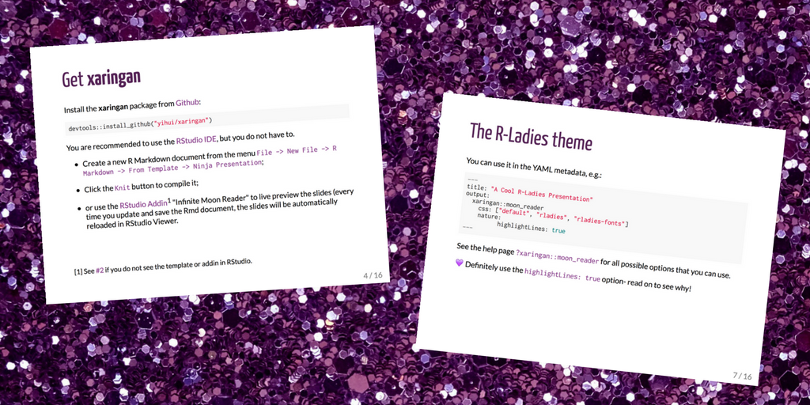
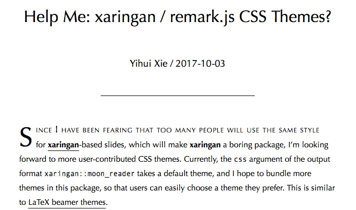

R-Ladies presentation ninja
================
Alison Hill
2018-04-28

So, you are doing an [R-Ladies](https://rladies.org) presentation...that's awesome!


Welcome- nice to meet you!
==========================

Hi - I am an R-Lady - you can find out more about me on my [website](https://alison.rbind.io), [GitHub](http://github.com/apreshill), or follow me on [twitter](http://twitter.com/apreshill). I'm also a co-author on the book [**blogdown: Creating Websites with R Markdown**](https://bookdown.org/yihui/blogdown/), and you can find some of my blog posts on the [blogdown demo site](https://blogdown-demo.rbind.io). If you use the R-Ladies **xaringan** theme and you are on twitter, I'd love to see it- [please mention me so I can link to your slides!](https://twitter.com/intent/tweet?user_id=3199856542)

The short version
=================

I made an [R-Ladies](https://rladies.org) theme for [**xaringan** slides](https://github.com/yihui/xaringan). The way to use the theme is to update the YAML like so:

``` yaml
output:
  xaringan::moon_reader:
    css: ["default", "rladies", "rladies-fonts"]
```

Make sure your version of **xaringan** is up-to-date.

 Below is a [demo slide deck](https://alison.rbind.io/slides/rladies-demo-slides.html#1) using the theme, which also highlights some of the **xaringan** bells and whistles you can use.

    ## PhantomJS not found. You can install it with webshot::install_phantomjs(). If it is installed, please make sure the phantomjs executable can be found via the PATH variable.

<iframe src="https://alison.rbind.io/slides/rladies-demo-slides.html#1" width="100%" height="400px">
</iframe>
(view the [source .Rmd on GitHub](https://github.com/rbind/apreshill/blob/master/static/slides/rladies-demo-slides.Rmd))

The longer story
================

I recommend [Yihui's](https://yihui.name) [**xaringan** package](https://github.com/yihui/xaringan) for slides. This is an R package, available through GitHub, for creating slideshows with [remark.js](https://remarkjs.com/) through R Markdown. This means that you can:

-   write all your slides in Markdown text
-   include chunks of R code and rendered output like plots, results, tables, etc. in your slides
-   use git for version control and share your GitHub repository

This makes [**xaringan**](https://github.com/yihui/xaringan) ideal for an [R-Ladies](https://rladies.org) presentation![1]

To use the package, you'll need the [**devtools** package](https://cran.r-project.org/web/packages/devtools/index.html) installed so that you can use the `install_github` function. Then do:

``` r
devtools::install_github('yihui/xaringan')
```

As Yihui points out in the documentation, if you use RStudio, you can use the menu to navigate to `File -> New File -> R Markdown -> From Template -> Ninja Presentation`, and you will see an R Markdown example.

I first used [**xaringan**](https://github.com/yihui/xaringan) a few months ago. I was working with [Yihui](https://yihui.name) on the [blogdown book](https://bookdown.org/yihui/blogdown/), and had signed up to lead a [workshop](https://alison.rbind.io/talk/blogdown-meetup/) for the [Portland R User group](https://www.meetup.com/portland-r-user-group/). Obviously, such a workshop could not have powerpoint slides, so it seemed like the perfect time to learn [**xaringan**](https://github.com/yihui/xaringan).

For my [workshop](https://alison.rbind.io/talk/blogdown-meetup/), I made a simple website for the newly founded [R-Ladies PDX](https://rladies-pdx.rbind.io) using blogdown (Thanks to [Augustina](https://twitter.com/mmmpork) and [Deeksha](https://twitter.com/deekshathati), our fearless organizers). So naturally, my slides needed more purple.


Luckily, the R-Ladies run a tight ship- they have a [starter kit on GitHub](https://github.com/rladies/starter-kit) that details all the pretty purples they like.


About a month after I did the [R-Ladies blogdown workshop](https://alison.rbind.io/talk/blogdown-meetup/), I saw this [blog post](https://yihui.name/en/2017/10/xaringan-themes/) by [Yihui](https://yihui.name):



First, I thought this was such a cool idea and I hope more people make and submit themes. Then I realized, I had already made a theme! I submitted a pull request[2], Yihui helped me make some edits to the CSS files to make them more parsimonious with the default theme, I electronically signed a contributor agreement, and now the theme is there for you all to enjoy and use! You use the theme by editing the YAML:

``` yaml
output:
  xaringan::moon_reader:
    css: ["default", "rladies", "rladies-fonts"]
```

Examples!

-   My blogdown workshop slides: ["Up and running with blogdown"](http://127.0.0.1:4321/talk/blogdown-meetup/) (view the [source .Rmd on GitHub](https://github.com/rbind/apreshill/blob/master/static/slides/blogdown-workshop-slides.Rmd))

<iframe src="https://alison.rbind.io/slides/blogdown-workshop-slides.html#1" width="100%" height="400px">
</iframe>
-   [Jessica Minnier's](http://jessicaminnier.com) slides for ["Building Shiny Apps: With Great Power Comes Great Responsibility"](http://jminnier-talks.netlify.com/2018_02_shiny_csp/minnier_csp2018#1)

<iframe src="http://jminnier-talks.netlify.com/2018_02_shiny_csp/minnier_csp2018#1" width="100%" height="400px">
</iframe>
-   [Angela Li's](https://twitter.com/CivicAngela) slides for ["Introduction to Spatial Data Analysis and Mapping in R"](https://angela-li.github.io/slides/2018-04-26/rladies-spatial-data#1)

<iframe src="https://angela-li.github.io/slides/2018-04-26/rladies-spatial-data#1" width="100%" height="400px">
</iframe>

[1] If you are new to [**xaringan**](https://github.com/yihui/xaringan), don't miss the [wiki!](https://github.com/yihui/xaringan/wiki)

[2] Yihui's [technical instructions](https://yihui.name/en/2017/10/xaringan-themes/) for contributors section of that blog post has been revised and is very detailed
